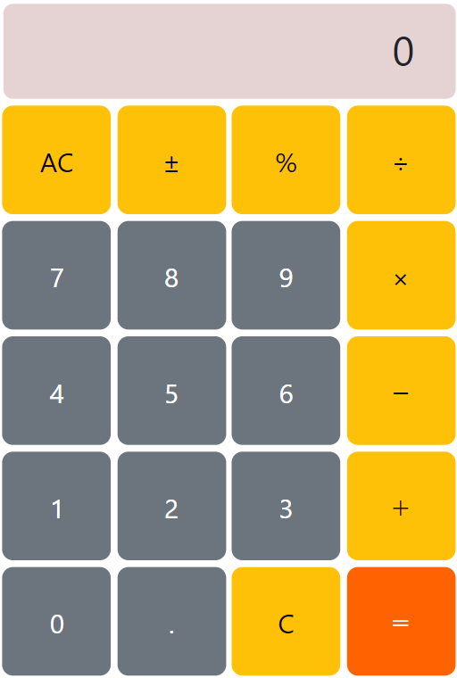

## Calculator
Calculator with minimum functions.

## Framework
Use [Bootstrap](https://getbootstrap.jp/docs/5.3/getting-started/introduction/) as `HTML` / `CSS` framework.

## Developed by
- [Masa](https://github.com/masataisyou)
    - Mainly responsible for `HTML`, `CSS`.
- [Yg](https://github.com/clumsyg)
    - Mainly responsible for `JavaScript`.

## Attention
[Rounding errors](https://e-words.jp/w/%E4%B8%B8%E3%82%81%E8%AA%A4%E5%B7%AE.html) may result in incorrect calculation results. e.g. 9.7 + 2.1
